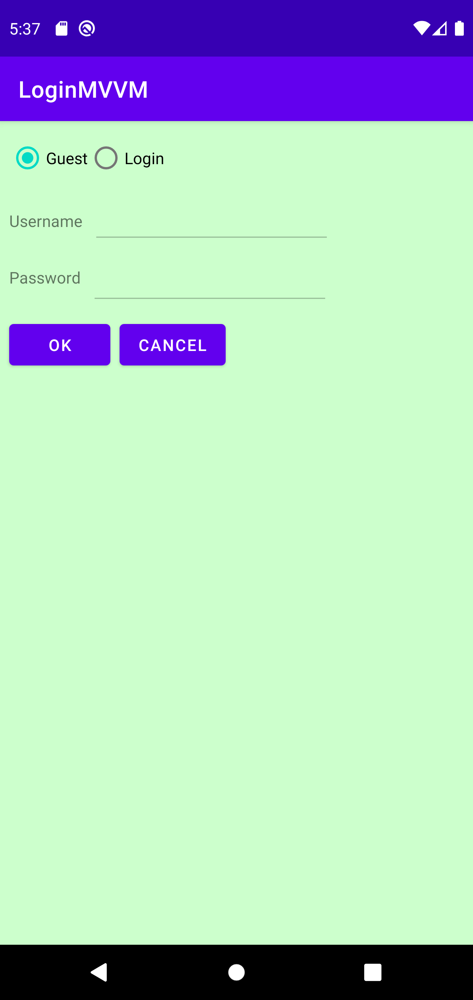

# Android_MVVM_Mediator_Login

[結城浩著「増補改訂版 Java言語で学ぶ デザインパターン入門」](https://www.hyuki.com/dp/) 第16章「Mediator ― 相手は相談役1人だけ」のサンプルプログラムである「名前とパスワードを入力するログインダイアログ」を、
Android の MVVM で実装する。

使い方は次のとおり。

- ゲストでのログイン［Guest］か登録ユーザーでのログイン［Login］かを選択する。
- 登録ユーザーでのログインの場合はユーザー ID［Username］とパスワード［Password］を入力する。
- ［OK］ボタンを押してログインする。
- キャンセルするなら［Cancel］ボタンを押す。

UI は次のように動作する。

- ［Guest］が選択された状態では
  ［Username］と［Password］は入力不可。
- ［Login］が選択された状態では
  ［Username］は入力可。
- ［Login］が選択された状態で
  ［Username］に１文字以上入力されていれば
  ［Password］は入力可。
- ［OK］ボタンは
    - ［Guest］が選択された状態では常に押下可。
    - ［Login］が選択された状態では
      ［Username］と［Password］が共に１文字以上入力されていれば押下可。
- ［Cancel］ボタンは常に押下可。

ボタンが押されたときの動作は次のとおり。

- ［OK］ボタンが押されたら
    - ［Guest］が選択されていれば次の画面に進む。
    - ［Login］が選択されていれば
        - ユーザー ID とパスワードが合っていれば次の画面に進む。
        - そうでなければエラーメッセージを表示する。
- ［Cancel］ボタンが押されたら前の画面に戻る。
